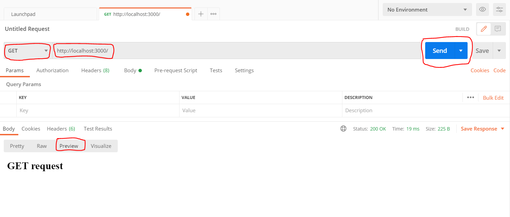
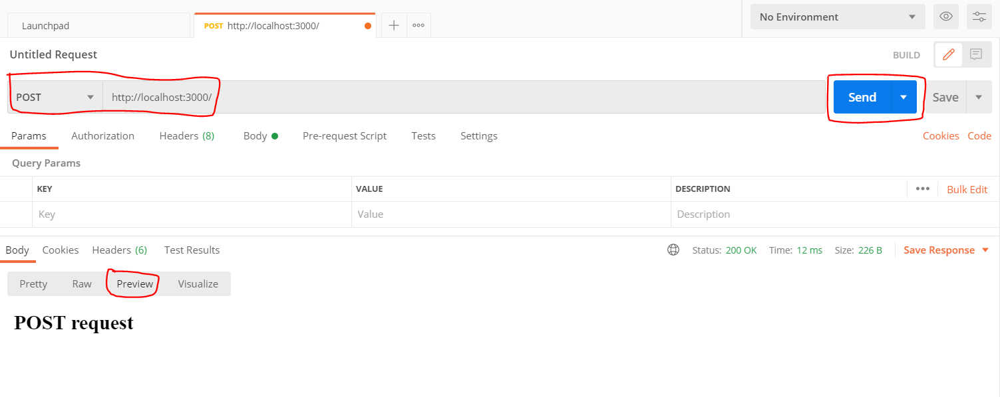

# Express - server

new project:

1. Create new folder and open in terminal.
2. `npm init`
3. install express from NPM:

```
npm install express

// or

npm i express
```

4. for live server - we install nodemon

```
npm i nodemon
```

Activate in package.json:

```json
"start": "nodemon server.js"
```

- package.json

```json
{
  "name": "my-app",
  "version": "1.0.0",
  "description": "",
  "main": "index.js",
  "scripts": {
    "test": "echo \"Error: no test specified\" && exit 1",
    "start": "nodemon server.js"
  },
  "author": "",
  "license": "ISC",
  "dependencies": {
    "express": "^4.17.1",
    "nodemon": "^2.0.7"
  }
}
```

### server.js

```js
// import the module express
const express = require("express");

// express() function - Creates an Express application.
const app = express();
const PORT = 3000;

// for get(path, RequestHandler) requests:
app.get("/", (req, res) => res.send("<h2>GET request</h2>"));

// for post requests:
app.post("/", (req, res) => res.send("<h2>POST request</h2>"));

// listen(port, callback function) -> activate the app
app.listen(PORT, () => console.log(`Listening in port ${PORT}...`));
```

## Use postman:

https://www.postman.com/downloads/



