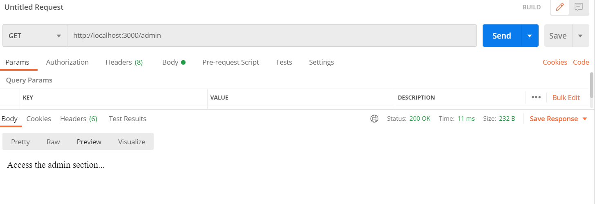

# 3 ways to send requests

The most basic way - through the browser. (Only get requests by default). 

### 1. postman

Program that allows us to send requests to any url and get response (using any request type)



### 2. cURL

In CMD - we can get using cURL pages in HTML format.

```
C:\Users\raya>curl -X GET http://localhost:3000
GET request
C:\Users\raya>curl -X POST http://localhost:3000
POST request
C:\Users\raya>curl -X PUT http://localhost:3000
PUT request
C:\Users\raya>curl -X DELETE http://localhost:3000
DELETE request
C:\Users\raya>curl -X GET http://localhost:3000/admin
Access the admin section...
```

### 3. VSC extention - REST client


- Create new file `req.http`:

```
GET http://localhost:3000

### separate requests

POST http://localhost:3000

###

PUT http://localhost:3000

###
DELETE http://localhost:3000

### To this url we can access through any requst type
GET http://localhost:3000/admin
```

- We can make it smarter using global variables:

```
# Use veriables:
@baseUrl = http://localhost:3000

GET {{baseUrl}}

### separate requests

POST {{baseUrl}}
###

PUT {{baseUrl}}

###
DELETE {{baseUrl}}

### To this url we can access through any requst type
GET {{baseUrl}}/admin
```
