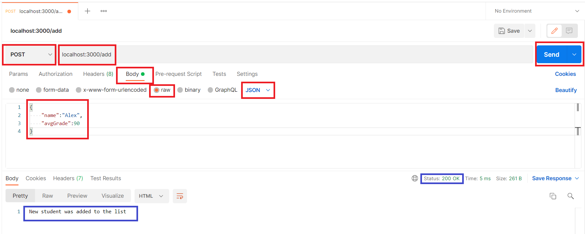
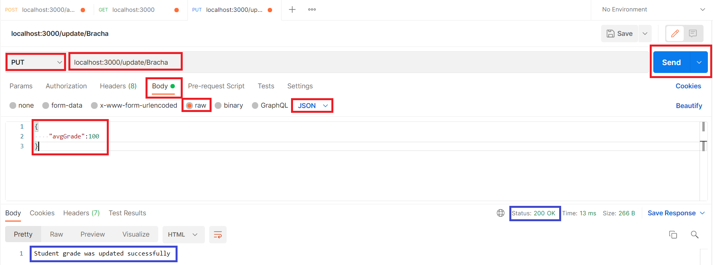
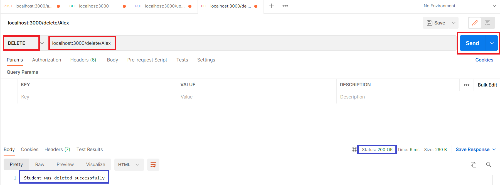

> Note: הקלטה של שיעור 8 תהיה במודל - נא לצפות עד לשיעור הבא.

# Students App with 4 requests

In this app we have an array that will be updated using the 4 methods:

1. GET - show all students in the array
2. POST - add a new student to the array
3. PUT - update the avgGrade for specific student
4. DELETE - delete a student from the array

### Send requests

#### cURL requests:

- request: -X, --request
- header: -H, --header
- data(body): -d, --data

```
C:\Users\raya>curl -X GET http://localhost:3500
[]
C:\Users\raya>curl -X POST -H "Content-Type: Application/json" -d "{\"name\":\"John\", \"avgGrade\":70}" http://localhost:3500/add
New student was added to the list
C:\Users\raya>curl -X POST -H "Content-Type: Application/json" -d "{\"name\":\"Alex\", \"avgGrade\":98}" http://localhost:3500/add
New student was added to the list
C:\Users\raya>curl -X GET http://localhost:3500/
[{"name":"John","avgGrade":70},{"name":"Alex","avgGrade":98}]
C:\Users\raya>curl -X PUT -H "Content-Type: Application/json" -d "{\"avgGrade\":\"100\"}" http://localhost:3500/update/John
Student's avgGrade was updated successfully
C:\Users\raya>curl -X GET http://localhost:3500/
[{"name":"John","avgGrade":"100"},{"name":"Alex","avgGrade":98}]
curl -X DELETE http://localhost:3500/delete/Alex
```

#### Postman:

- POST request



- PUT request



- DELETE request



#### REST client

```js
@website = http://localhost:3000

### GET

GET {{website}}

### POST

POST {{website}}/add
Content-Type: application/json

{
    "name":"Alex",
    "avgGrade":80
}

### PUT

PUT {{website}}/update/Alex
Content-Type: application/json

{
    "avgGrade":90
}

### DELETE
DELETE {{website}}/delete/Alex


```
